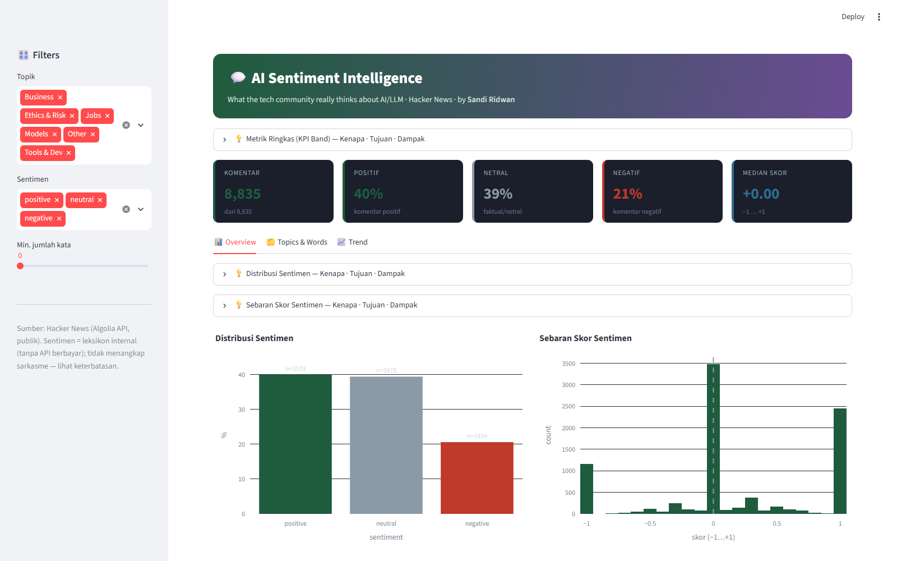
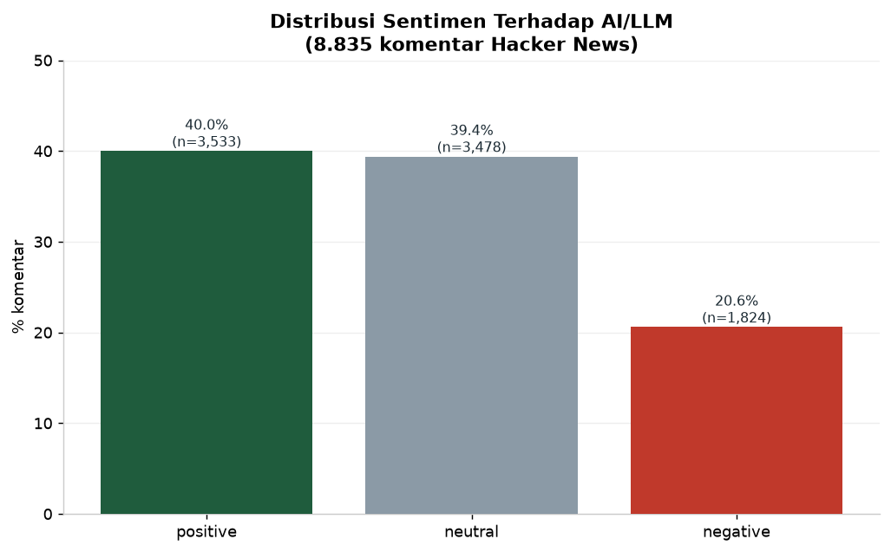
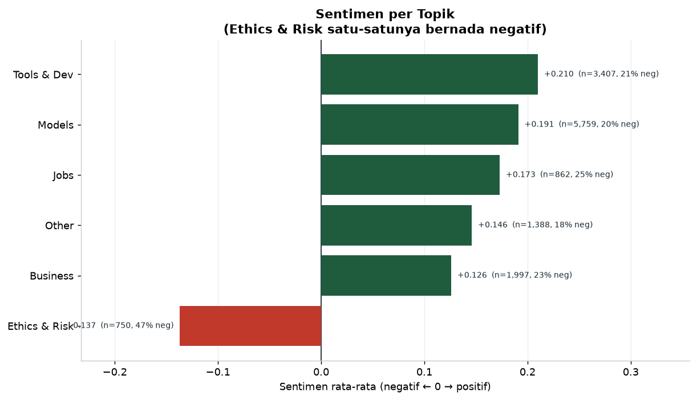
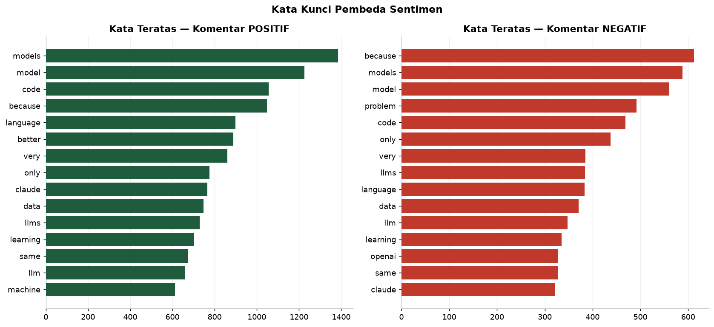
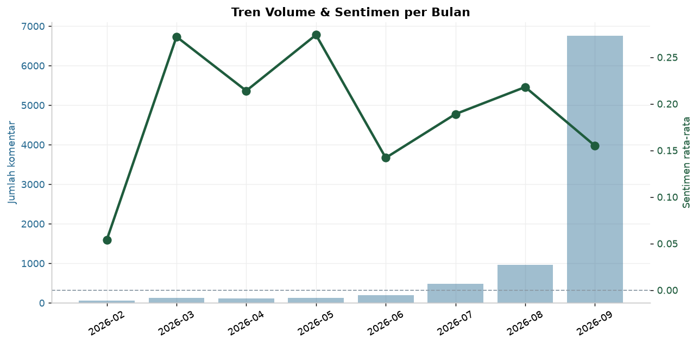

<div align="center">


<br/>


</div>

---

```
╔══════════════════════════════════════════════════════════════════════════╗
║                                                                          ║
║   █████╗ ██╗    ███████╗███████╗███╗   ██╗████████╗██╗███╗   ███╗███████╗ ║
║  ██╔══██╗██║    ██╔════╝██╔════╝████╗  ██║╚══██╔══╝██║████╗ ████║██╔════╝ ║
║  ███████║██║    ███████╗█████╗  ██╔██╗ ██║   ██║   ██║██╔████╔██║█████╗   ║
║  ██╔══██║██║    ╚════██║██╔══╝  ██║╚██╗██║   ██║   ██║██║╚██╔╝██║██╔══╝   ║
║  ██║  ██║██║    ███████║███████╗██║ ╚████║   ██║   ██║██║ ╚═╝ ██║███████╗ ║
║  ╚═╝  ╚═╝╚═╝    ╚══════╝╚══════╝╚═╝  ╚═══╝   ╚═╝   ╚═╝╚═╝     ╚═╝╚══════╝ ║
║                                                                          ║
║   WHAT THE TECH COMMUNITY REALLY THINKS ABOUT AI & LLM                   ║
╚══════════════════════════════════════════════════════════════════════════╝
```

---

## 🎬 Demo

<div align="center">
  
  <br/>
  <sub><i>Interactive dashboard — sentiment distribution, topics, keywords, trend</i></sub>
</div>

<br/>

```bash
streamlit run app/dashboard.py     # → http://localhost:8506
```

---

## 🧠 Overview

**AI Sentiment Intelligence** mengubah **8.835 komentar publik** dari Hacker News
menjadi gambaran terukur: bagaimana komunitas teknologi **benar-benar** menilai
AI/LLM — sentimen keseluruhan, per topik, dan trennya.

<div align="center">

| Metric | Value |
|-------:|:------|
| 📊 Sumber | Hacker News (Algolia API publik) — tanpa API key |
| 💬 Komentar | **8.835** unik (Feb–Sep 2026) |
| 🎭 Positif / Netral / Negatif | **40% / 39% / 21%** |
| 🗂️ Topik | Models · Tools & Dev · Business · Jobs · Ethics & Risk |
| 🧠 NLP | Sentimen leksikon (tanpa API berbayar) + topik + tren waktu |
| 📁 Output | Streamlit app · 6 charts · 6 tabel insight |

</div>

---

## 🔑 Temuan Utama

| # | Temuan | Angka |
|---|--------|-------|
| 1 | Sentimen AI **net positif** | 40% positif vs 21% negatif |
| 2 | **Ethics & Risk satu-satunya topik negatif** | mean −0.137 · **47% negatif** |
| 3 | **Tools & Dev paling positif** | mean +0.210 · 47% positif |
| 4 | Keyword negatif = keluhan konkret | "problem", "because", "only" |
| 5 | Lonjakan volume September | 6.763 komentar (bulan terbesar) |

**Insight kunci:** publik **antusias pada teknologi & alat AI**, tetapi **khawatir pada etika/risiko** — pola klasik adopsi teknologi yang perlu komunikasi berbeda per audiens.

---

## 📊 Visualisasi

| Distribusi sentimen | Sentimen per topik |
|:---:|:---:|
|  |  |

| Kata kunci pembeda | Tren bulanan |
|:---:|:---:|
|  |  |

---

## ⚡ Metodologi NLP (Jujur & Reproducible)

**Sentimen leksikon internal** (bukan API berbayar):
- skor = (kata positif − negatif) / total kata bernada, dengan **negasi** & **intensifier**
- **Alasan tidak pakai transformer:** model besar butuh unduhan/GPU → berat untuk
  portofolio yang harus mudah direproduksi siapa pun.

**Keterbatasan yang diakui terbuka:**
1. Leksikon **tidak memahami sarkasme** & konteks rumit
2. Domain teknologi punya jargon (mis. "bias" bisa teknis atau sosial)
3. Hacker News = komunitas tech (bukan sampel populasi umum)

> Sampel komentar paling positif/negatif disediakan di dashboard agar pembaca
> dapat **memverifikasi kualitas** skor — bukan hanya menerima angka.

---

## 🏗️ Architecture

```
┌──────────────────────────────────────────────────────────────────────┐
│  collect_sentiment.py  (Hacker News Algolia API — publik)            │
│  10 query × 10 halaman × 100  → deduplikasi → 8.835 komentar         │
└──────────────────────────────┬───────────────────────────────────────┘
                               ▼
┌──────────────────────────────────────────────────────────────────────┐
│  analysis.py — NLP LAYER                                             │
│  · lexicon sentiment (negasi + intensifier)                          │
│  · topik (keyword mapping)                                           │
│  · agregasi: per topik, per bulan, top terms, contoh komentar        │
└───────────────┬───────────────────────────────┬──────────────────────┘
                ▼                               ▼
      reports/figures (6 chart)        app/dashboard.py (Streamlit)
                                       + explanations.py (Kenapa-Tujuan-Dampak)
```

---

## 📁 File Structure

```
ai-sentiment-intelligence/
├── app/dashboard.py             # ⭐ dashboard interaktif (+ penjelasan tiap chart)
├── src/
│   ├── config.py                # path + warna (terpusat)
│   ├── collect_sentiment.py     # ambil komentar HN
│   ├── analysis.py              # NLP: sentimen, topik, tren (murni)
│   ├── explanations.py          # narasi Kenapa · Tujuan · Dampak
│   ├── run_analysis.py          # orkestrator
│   └── make_charts.py           # 6 visualisasi
├── data/{raw,processed}/
├── reports/{figures,tables}/
├── docs/DEPLOY_CHECKLIST.md
├── REPORT.md
└── requirements.txt
```

---

## 🚀 Quick Start

```bash
pip install -r requirements.txt

python src/collect_sentiment.py   # ambil 8.8k komentar HN
python src/run_analysis.py        # tabel + summary
python src/make_charts.py         # 6 chart
python src/explanations.py        # audit: semua penjelasan lengkap?
streamlit run app/dashboard.py
```

---

## 📖 Cara Membaca Dashboard (Kenapa · Tujuan · Dampak)

Setiap chart & tabel punya kotak penjelasan yang menjawab:

| Pertanyaan | Arti |
|-----------|------|
| **🔎 Kenapa** | Mengapa metrik ini dipilih (masalah & konteks) |
| **🎯 Tujuan** | Pertanyaan bisnis yang dijawab |
| **📈 Dampak** | Implikasi / keputusan yang timbul |
| **👁️ Cara baca** | Panduan bila grafik tak intuitif |

Narasi tersimpan di `src/explanations.py` (dapat diaudit).

---

## 🛠️ Tech Stack

<div align="center">

| Layer | Teknologi |
|-------|-----------|
| **Data** | Hacker News Algolia API · curl_cffi |
| **NLP** | leksikon sentimen internal + negasi/intensifier |
| **Analisis** | pandas · numpy |
| **Visualisasi** | matplotlib · Plotly |
| **Dashboard** | Streamlit |

</div>

---

## 📝 Lessons Learned

1. **Data publik terbaik ada di API yang tepat.** HN Algolia memberi 8.8k komentar
   berkualitas tanpa API key — Reddit (403) & GDELT (rate-limit) lebih rumit.
2. **Sentimen leksikon cukup bermakna** bila ditangani dengan negasi + intensifier,
   dan **jujur soal batasnya** (sarkasme) lebih baik daripada klaim berlebihan.
3. **Satu angka menyesatkan.** Memecah per topik langsung mengungkap temuan
   terpenting (Ethics negatif, Tools positif).
4. **Sediakan contoh kualitatif** agar skor dapat diverifikasi, bukan dipercaya buta.
5. **Boilerplate mempercepat.** Project ini dibuat dari template #5 — standar
   (penjelasan, pisah analisis) langsung terpasang.

---

## ⚠️ Disclaimer

Analisis edukasional. Sentimen dihitung dengan leksikon sederhana (bukan model
transformer) dan hanya mewakili komunitas Hacker News. Bukan saran bisnis/investasi.

---

## 👤 Author

<div align="center">


**Data Analyst · Data Automation Engineer · Python**

📍 Palu, Central Sulawesi, Indonesia

[](https://www.upwork.com/freelancers/~011f6d0fbb4a372974)
[](https://linkedin.com/in/sandi-ridwan)
[](https://github.com/SandiRidwan)

</div>

---

## 📄 License

MIT License — Educational and portfolio purposes only. Data from Hacker News (public).
